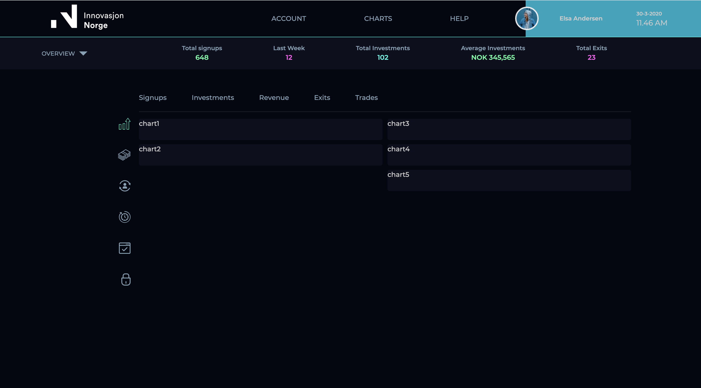

# The Challenge

## How to run

> `npm run dev`

The task was to provide a solution to a challenge, which is to implement the prototype seen below.

## The goal

  

## What is implemented so far

  

